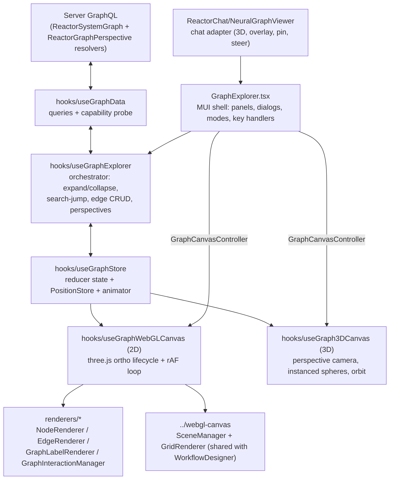

# GraphExplorer

`core.GraphExplorer@1.0.0` — the explorer for the Reactor system graph, with
**two renderers over one engine**: a 2D PCB-styled board
(`useGraphWebGLCanvas`) and a 3D orbit view (`useGraph3DCanvas`). It walks
projects cataloged by `reactor.ReactorProjectService` (server) and supports
lazy neighbourhood expansion, dependency/dependent traversal, server path
finding, search-jump, edge create/edit/delete, node data editing,
hide/unhide, type filters, three layouts and a complete perspective
lifecycle (save / save-as / rename / duplicate / share / default / delete).

Mounted by the server-driven route `/reactor/graph/:projectId?/:nodeId?`
(see `reactory-express-server/src/data/clientConfigs/reactory/routes/index.ts`)
— `projectId` resolves to the project's graph root via
`ReactorProject.graphNodeId`, `nodeId` deep-links (hydrates + focuses) a node.
Registered in `src/components/index.tsx` via the co-located
`GraphExplorerComponentDefinition` at the tail of `GraphExplorer.tsx`.

The chat's Neural Graph side-panel viewer (`reactor.NeuralBackground@1.0.0`,
`ReactorChat/components/NeuralGraphViewer.tsx`) is a thin adapter that
mounts this component in 3D with chat props (conversation root, agent
overlay, steering, pin) — so the 2D and 3D surfaces have identical
capabilities by construction. The ambient background behind the chat
(`NeuralBrainBackground.tsx`) is decoration only and does not talk to the
server.

## Architecture



Three layers, one direction of truth:

1. **Data** (`useGraphData`) speaks GraphQL and converts wire shapes to the
   domain model through one seam (`utils/graphMapping.ts`). Nothing else in
   the component ever sees a raw GraphQL response.
2. **State** (`useGraphStore` + `useGraphExplorer`) holds the graph and
   decides what happens. React state via `useReducer` for structure
   (nodes/edges/selection/expansion), plus two mutable side-channels that
   deliberately bypass React (see *Positions & animation*).
3. **Rendering** (`useGraphWebGLCanvas` + `renderers/`, or `useGraph3DCanvas`)
   is imperative three.js driven by a single rAF loop. Both hooks take the same
   props and implement the same `GraphCanvasController` contract
   (`getCamera/setCamera/fitToContent/focusOn/runForceLayout/setEdgePreview`),
   so the shell never branches on the renderer. React re-renders only for
   things the DOM shell needs (zoom readout, hovered id, marquee, panels).

## File map

```
GraphExplorer/
  GraphExplorer.tsx          shell: drawers, toolbar, dialogs, tool modes (edge/path),
                             root resolution, overlay/steering, keyboard,
                             + GraphExplorerComponentDefinition (registration)
  types.ts                   GraphNode / GraphEdge / GraphPerspective / camera /
                             store & action types / props / GraphCanvasController
  constants.ts               PCB palette, LOD thresholds, layout, animation, 3D tuning
  hooks/
    useGraphData.ts          GraphQL layer, capability probe, perspective fallback
    useGraphStore.ts         reducer (nodes/edges/hidden/filters/perspective/dirty),
                             PositionStore, animator, selectVisible,
                             containmentSubtree/collapsibleSubtree/containmentDepths
    useGraphExplorer.ts      orchestrator (the "controller"): traversal, paths,
                             editing, visibility, layouts, perspective lifecycle
    useGraphWebGLCanvas.ts   2D three.js glue: manager lifecycles, geometry sync,
                             rAF stepping of tweens/layouts, viewport animation
    useGraph3DCanvas.ts      3D renderer: orbit camera, instanced spheres, line
                             edges, sprite labels, raycast picking, node drag
  renderers/
    types.ts                 NodeGeometryData / EdgeGeometryData / event contracts
    NodeRenderer.ts          one InstancedMesh, SDF-circle shader, icon atlas
    EdgeRenderer.ts          one LineSegments buffer + instanced arrowheads
    GraphLabelRenderer.ts    CSS2D labels, hard-capped (MAX_VISIBLE_LABELS)
    GraphInteractionManager.ts  pointer/touch state machine, hit testing
  layouts/
    radialExpansion.ts       deterministic fan for freshly expanded children
    forceLayout.ts           headless d3-force (one-shot + stepping variants)
    hierarchicalLayout.ts    dagre tree mode
  components/Panels/         CatalogPicker, SearchPanel, FilterPanel (all types),
                             Inspector (node + edge), BreadcrumbBar, GraphToolbar
                             (2D/3D, layout, path tool, perspective chip),
                             GraphContextMenu, EdgeEditorDialog (create/edit),
                             NodeDataDialog, Save/PerspectiveManager dialogs
  utils/
    graphMapping.ts          GraphQL ↔ model seam (endpoint normalization,
                             CONTAINS synthesis, perspective + overlay mapping)
    spatialHash.ts           uniform-grid index (hit tests; eviction on sync)
    positionAnimator.ts      tween layer over the PositionStore (x, y, z)
    perspective.ts           localStorage fallback for saved views
  __tests__/                 store, visibility/perspective state, mapping,
                             perspective round-trip, layouts, hash, animator
```

## Key concepts

### Node identity

Node ids are **deterministic hashes** minted by the server
(`GraphIdentity.nodeId(logicalKey)`), stable across sessions — which is what
makes saved perspectives and idempotent edge ids possible. Every node also
carries an ancestry `key` (`"rootId|...|nodeId"`) used for breadcrumbs, deep
links, and re-resolving lazily-materialized nodes (the server can walk the
key down the lazy tree when a node isn't in its cache).

### The graphMapping seam

`utils/graphMapping.ts` is the only place wire shapes are interpreted:

- Edge endpoints normalize to numbers whether the server sends scalar
  `sourceId`/`targetId`, nested node objects, or the legacy malformed mix
  (the bug that plagued the old D3 widget).
- `CONTAINS` edges are **synthesized client-side** from `parentId` when
  needed. They are never persisted — server-side `getSubgraph` enforces the
  same rule.
- Unknown node/link types degrade to `'UNKNOWN'` instead of crashing.

### Store, positions & animation

`useGraphStore` returns three cooperating pieces:

- **Reducer state** — `nodes`/`edges` maps, `adjacency` (nodeId → edge ids),
  `expanded`, `hidden`, `pinned`, `selection`, `filters`, plus the view
  settings (`layout`, `viewMode`, `depth`), the current `perspective` and a
  `dirty` flag. All structural changes go through actions (`MERGE_SUBGRAPH`,
  `COLLAPSE_NODE`, `HIDE_NODES`, `EDGE_UPSERT`, `SET_PERSPECTIVE`, …).
  `selectVisible` derives the render set (filters + hidden).
- **PositionStore** — a mutable, versioned `Map<nodeId, {x,y,z?}>`. The render
  loop reads it every frame; writing bumps `version`, and the canvas hook
  re-syncs geometry when the version moved. Positions intentionally do NOT
  live in React state: dragging/tweening at 60fps through `useReducer` would
  melt.
- **PositionAnimator** — tweens over the PositionStore (ease-out cubic,
  `ANIMATION_DURATION_MS`). Expansion grows children out of the parent;
  collapse pulls the subtree back in **before** dispatching the prune (the
  orchestrator computes the removable set with `collapsibleSubtree` — the
  exact helper the reducer uses, so animation and removal never disagree);
  drag-end realigns children; perspective load glides existing nodes. A user
  drag cancels a node's tween.

Pinning: user-dragged and perspective-restored nodes join `pinned`.
Expansion layouts and "Tidy" leave pinned nodes alone (Tidy falls back to
moving everything when *all* nodes are pinned); choosing a layout from the
toolbar is an explicit "rearrange everything" and clears pins.

### Rendering & scale

Built for thousands of nodes — the deliberate divergence from the
WorkflowDesigner's per-step meshes:

- **NodeRenderer**: a single `THREE.InstancedMesh` of unit quads with an
  SDF-circle fragment shader. Per-instance attributes carry position, radius,
  accent color, ring color, icon index, opacity. Icons come from one
  `CanvasTexture` atlas (a Material Icons glyph per `GraphNodeType`).
- **EdgeRenderer**: all edges in one `LineSegments` buffer (dashes are
  emitted as short segments), plus one instanced arrowhead mesh. One draw
  call per category regardless of edge count.
- **Labels**: CSS2D (crisp at any zoom) but hard-capped at
  `MAX_VISIBLE_LABELS`, shown only for LOD tier-2 nodes, selection and focus.
- **LOD**: screen radius (`radius × zoom`) buckets each node into
  dot / icon / icon+label tiers (`constants.ts` thresholds).
- **SpatialHash**: a uniform grid for the interaction manager's hover/click
  hit tests — O(1) per pointer move instead of a linear scan. Entries for
  nodes that left the render set are evicted on every sync so hidden or
  removed nodes are never clickable.

**3D renderer** (`useGraph3DCanvas`): perspective camera on an orbit rig
(drag rotates, shift/right-drag pans, wheel dollies), one `InstancedMesh` of
spheres coloured by type (overlay nodes in the agent accent), edges in a
vertex-coloured `LineSegments` buffer with selected edges re-drawn brighter,
canvas-texture sprite labels with distance LOD, wireframe rings for
selection/focus/hover, node drag on the camera-facing plane through the node,
raycast picking against the instanced mesh. Containment depth is spread along
z (`Z_LAYER_SPACING`) when a flat layout first enters 3D or a layout is
applied in 3D. World units are shared with 2D, so a position saved in either
renderer means the same thing in the other.

The neutral canvas core (`SceneManager` orthographic camera + shader
`GridRenderer`) lives in `../webgl-canvas` and is **shared with the
WorkflowDesigner** (its old import paths are re-export shims). Fixes to
camera math or resize handling land in both components; regression-smoke
`/workflows/editor` when touching it.

### The render loop

`SceneManager` owns the single rAF loop. Its post-render callback (installed
by `useGraphWebGLCanvas`) does, in order, every frame:

1. `animator.step(positions)` — advance position tweens.
2. Step any running chunked force layout ("tidy", `FORCE_FRAME_BUDGET_MS`
   per frame) and write results into the PositionStore.
3. Advance the viewport tween (focus/fit animations) — refs + camera only;
   React state commits once at the end.
4. If `positions.version` moved, `syncGeometry()` — rebuild instance
   attributes, spatial hash, label set, interaction state.
5. Render CSS2D labels.

`syncGeometry` reads the *latest* props through a `propsRef` — stable
callbacks, no stale closures, no per-frame React work.

### Interaction

`GraphInteractionManager` is a hand-rolled state machine (adapted from the
WorkflowDesigner's, ports removed): pan (drag empty canvas), wheel zoom
anchored under the cursor, shift-drag marquee, node drag, click vs
double-click discrimination, context menu, touch pan/pinch. Events flow out
through the `GraphCanvasEvents` contract; the shell decides what they mean
(double-click = toggle expand, right-click = context menu, Delete = hide,
Escape = cancel tool mode / clear selection, `f` = focus selection or fit).
The shell also owns two **tool modes**: *edge* (pick a target node to create
a link; a ghost line follows the pointer) and *path* (pick two nodes; the
server's `ReactorGraphPath` result is merged and selected).

### Layouts

- **Expansion**: `radialExpansion` fans new children on an arc away from the
  grandparent, then a bounded synchronous d3-force pass
  (`EXPANSION_REFINE_TICKS`, seeded from the fan, anchor + placed neighbours
  pinned) refines targets. Results are animated, never teleported.
- **Tidy** (toolbar): `createSteppingForceLayout` relaxes unpinned nodes as
  time-budgeted chunks inside the render loop so the graph visibly settles.
- **Layout menu** (toolbar, persisted in the perspective as `layout`):
  `radial` (BFS containment fan from the root), `force` (one-shot d3-force),
  `hierarchical` (dagre over CONTAINS edges). All three run through
  `useGraphExplorer.applyLayout`, animate, and add z spread in 3D.

All layouts are pure functions over plain data (`layouts/types.ts`) — unit
tested without three.js, and portable to a web worker later.

### Data layer & degradation

`useGraphData` mirrors the WorkflowDesigner `useGraphQL` pattern (typed
inline queries via `reactory.graphqlQuery`). On mount it runs a one-shot
**capability probe** (introspection of Query field names) and gates the
newer server API:

| Capability            | Used for                          | Fallback                     |
| --------------------- | --------------------------------- | ---------------------------- |
| `ReactorSubgraph`     | root load **and** node expansion (1 hop, real edges) | per-node `children` query |
| `ReactorNodes`        | batch resolve (breadcrumbs, load) | sequential `ReactorNode`     |
| `ReactorNodeLinks`    | edges among a saved node set (paged) | containment synthesis only |
| `ReactorGraphPath`    | path tool                         | disabled                     |
| `ReactorGraphPerspectives` | perspective persistence      | `localStorage` (multi-entry) |

If introspection is disabled the probe assumes the full API rather than
silently degrading. Other operations used: `ReactorProject.graphNodeId`
(route → root), `ReactorConversationNode` (chat root), `ReactorNodesByTerm`,
`ReactorCreate/Update/DeleteNodeLink`, `ReactorUpdateNode` (data payload),
`ReactorSave/Duplicate/DeleteGraphPerspective`.

Note: `reactory.graphqlMutation` does **not** throw on GraphQL errors — every
mutation in the data layer checks `response.errors` and throws with the
server's message so failures surface in the snackbar instead of a silent
"Edge created". Derived edges (dependency previews, containment) are marked
`synthetic` and are never sent to the delete mutation.

### Perspectives

A perspective is everything needed to reproduce a view in **either**
renderer: `{nodeId, x, y, z?}` positions, expanded ids, hidden ids, type
filters, `layout`, `viewMode`, traversal `depth`, a world-space camera
(`target` + optional `camera` eye + `zoom` — never screen-space pan offsets),
`share` and `isDefault`. Persisted per user (`reactor_graph_perspectives`,
owner-scoped; shared ones are visible read-only to everyone; one default per
owner and root).

The store tracks the **current** perspective and a `dirty` flag (toolbar chip
turns amber). Lifecycle in `useGraphExplorer`: `savePerspective` updates the
current one in place when owned (a shared one saves as a private copy),
`saveAsPerspective` creates, `renamePerspective` / `setPerspectiveShare` /
`setPerspectiveDefault` patch metadata only, `duplicatePerspective` copies
server-side, `deletePerspective`, and `openRoot` applies the owner's default
for that root (never an arbitrary first entry).

`applyPerspective` re-materializes: it diffs saved ids against the store,
batch-fetches missing nodes and the persisted edges among the set
(`getEdgesAmong`), merges (restoring the expanded set), applies view
settings and hidden ids, and only then applies positions + pins and hands the
camera back to the shell, which forwards it to whichever renderer is active.

### PCB theme

The visual language follows the WorkflowDesigner's `CircuitTheme`: dark-green
board (`BOARD_BACKGROUND`), copper-mask grid, nodes as black IC epoxy bodies
with a type-accented "pad" ring and glyph (`NODE_TYPE_COLORS`), copper traces
for edges (gold symlinks, faint green containment), gold selection ring /
cyan focus / bright-copper hover, silkscreen mono labels. All knobs live in
`constants.ts`.

## Server counterparts

(All under `reactory-express-server/src/modules/reactory-reactor/` — a
separate git repo.)

- **Traversal façade**: `services/SystemGraphManager.ts` — `getNodes`,
  `getNodeLinks`, `getSubgraph` (bounded BFS, CONTAINS synthesis, opt-in
  budgeted lazy materialization), `searchNodes`, `findPath`. Resolvers, AI
  macros and the workflow step all delegate here.
- **GraphQL**: `graphql/schema/ReactorSystemGraph/{graph,perspective,project}.graphql`
  and resolvers `ReactorSystemGraph.ts` / `ReactorGraphPerspective.ts`.
  `perspective.graphql` carries the full view state (filters, hiddenNodeIds,
  layout, viewMode, depth, isDefault, world-space viewport) plus
  `ReactorDuplicateGraphPerspective`; `ReactorGraphPerspectives` filters by
  `projectId` and/or `rootNodeId`; `ReactorProject.graphNodeId` maps a
  project to its catalog node.
  ⚠️ The `@query/@mutation/@property` decorators copy **unbound** functions
  into the resolver map — `this` inside a decorated method is Apollo's field
  object. Helpers must be module-level functions (both files carry a comment
  explaining this; it has bitten before).
- **Agent tools**: `ai/macro/graph/` — `searchGraph`, `getGraphNode`,
  `graphChildren`, `exploreGraph`, `graphLinks` (read, auto-safe) and
  `createNodeEdge` (write, requires approval in safe_auto/plan).
- **Workflow step**: `workflow/steps/GraphQueryStep.ts` (`type: graph_query`)
  with `workflow/GraphExplore.yaml` as the reference workflow.

## Editing guide / gotchas

- **Adding a node type**: extend `GraphNodeType` + `ALL_NODE_TYPES` (types.ts),
  `NODE_TYPE_COLORS`, `NODE_TYPE_ICONS` (constants.ts). The filter panel and
  the mapping seam derive from `ALL_*_TYPES`, so nothing else needs a list.
- **Adding renderer behaviour**: extend `GraphCanvasController` (types.ts) and
  implement it in *both* canvas hooks — the shell only talks to the contract.
- **Adding a store action**: types.ts union → reducer case → a test in
  `__tests__/graphStore.test.ts`. Keep `adjacency` consistent with `edges`
  in every case (see existing cases for the clone-then-mutate pattern).
- **Never** put per-frame data (positions, tween state) in React state; write
  through the PositionStore so the version mechanism triggers geometry sync.
- **Derived edges are `synthetic`** (client-synthesized CONTAINS, server
  CONTAINS, dependency previews) — `deleteEdge` removes them from the view
  only and never calls the server.
- **Resize work must stay out of the ResizeObserver callback** — the shared
  SceneManager defers to rAF; doing layout synchronously there reintroduces
  the "ResizeObserver loop" overlay error.
- **Client GraphQL enum mirrors** (`GraphNodeType`/`GraphLinkType`) must stay
  a superset-compatible copy of the server enums — new server enum values
  need a lockstep client addition before querying them.

## Testing

```bash
# from reactory-pwa-client/
npx jest src/components/shared/GraphExplorer   # store, visibility, mapping, perspectives, layouts, hash, animator
npx tsc --noEmit                               # strict type check
```

Layouts, mapping, store and animator are pure — no three.js/DOM mocking.
Rendering and interaction are verified manually: seed data via
`ReactorSyncCatalogNodes`, open `/reactor/graph`, and exercise expansion,
search-jump, edge/node editing, the path tool, hide/unhide, layouts, the
2D↔3D toggle and the perspective manager — then open the chat's Neural
Graph side panel and confirm the same perspective loads there. When touching
`../webgl-canvas`, also smoke `/workflows/editor` (both `circuit` and
`default` theme modes).
