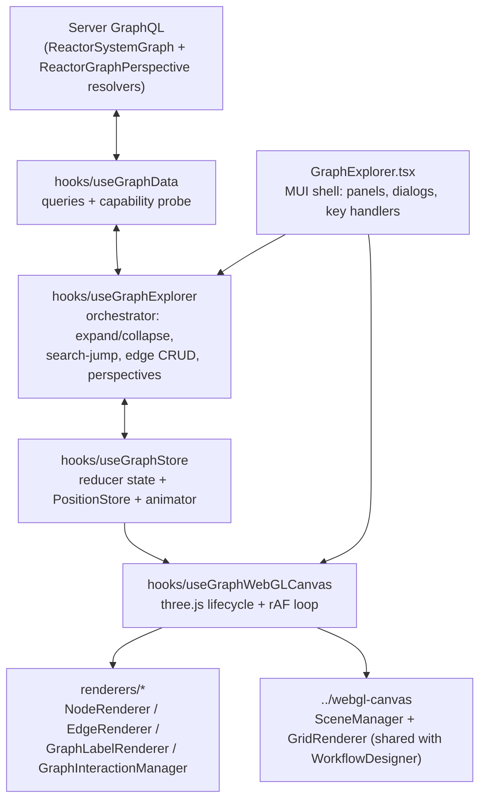

# GraphExplorer

`core.GraphExplorer@1.0.0` — a first-class three.js explorer for the Reactor
system graph. It walks projects cataloged by `reactor.ReactorProjectService`
(server), renders them as an interactive PCB-styled node/edge canvas, and
supports lazy expansion, edge traversal, search, edge CRUD and saved
perspectives.

It replaces the old D3 form widget (`reactor.ReactorGraphExplorerWidget`,
deleted) and is mounted by the server-driven route
`/reactor/graph/:catalogId?` (see
`reactory-express-server/src/data/clientConfigs/reactory/routes/index.ts`).
Registered in `src/components/index.tsx` via the co-located
`GraphExplorerComponentDefinition` at the tail of `GraphExplorer.tsx`.

## Architecture



Three layers, one direction of truth:

1. **Data** (`useGraphData`) speaks GraphQL and converts wire shapes to the
   domain model through one seam (`utils/graphMapping.ts`). Nothing else in
   the component ever sees a raw GraphQL response.
2. **State** (`useGraphStore` + `useGraphExplorer`) holds the graph and
   decides what happens. React state via `useReducer` for structure
   (nodes/edges/selection/expansion), plus two mutable side-channels that
   deliberately bypass React (see *Positions & animation*).
3. **Rendering** (`useGraphWebGLCanvas` + `renderers/`) is imperative
   three.js driven by a single rAF loop. React re-renders only for things the
   DOM shell needs (viewport zoom display, hovered id, panels).

## File map

```
GraphExplorer/
  GraphExplorer.tsx          shell: drawers, toolbar, dialogs, Delete-key handler,
                             + GraphExplorerComponentDefinition (registration)
  types.ts                   GraphNode / GraphEdge / store & action types / props
  constants.ts               PCB palette, LOD thresholds, layout + animation tuning
  hooks/
    useGraphData.ts          GraphQL layer, capability probe, perspective fallback
    useGraphStore.ts         reducer, PositionStore, animator, visible-set memo,
                             containmentSubtree/collapsibleSubtree helpers
    useGraphExplorer.ts      orchestrator (the "controller")
    useGraphWebGLCanvas.ts   three.js glue: manager lifecycles, geometry sync,
                             rAF stepping of tweens/layouts, viewport animation
  renderers/
    types.ts                 NodeGeometryData / EdgeGeometryData / event contracts
    NodeRenderer.ts          one InstancedMesh, SDF-circle shader, icon atlas
    EdgeRenderer.ts          one LineSegments buffer + instanced arrowheads
    GraphLabelRenderer.ts    CSS2D labels, hard-capped (MAX_VISIBLE_LABELS)
    GraphInteractionManager.ts  pointer/touch state machine, hit testing
  layouts/
    radialExpansion.ts       deterministic fan for freshly expanded children
    forceLayout.ts           headless d3-force (one-shot + stepping variants)
    hierarchicalLayout.ts    dagre tree mode
  components/Panels/         CatalogPicker, SearchPanel, FilterPanel, Inspector,
                             BreadcrumbBar, GraphToolbar, Edge/Perspective dialogs
  utils/
    graphMapping.ts          GraphQL → model seam (endpoint normalization,
                             CONTAINS synthesis)
    spatialHash.ts           uniform-grid index (culling + hit tests)
    positionAnimator.ts      tween layer over the PositionStore
    perspective.ts           localStorage fallback for saved views
  __tests__/                 store, mapping, layouts, spatial hash, animator
```

## Key concepts

### Node identity

Node ids are **deterministic hashes** minted by the server
(`GraphIdentity.nodeId(logicalKey)`), stable across sessions — which is what
makes saved perspectives and idempotent edge ids possible. Every node also
carries an ancestry `key` (`"rootId|...|nodeId"`) used for breadcrumbs, deep
links, and re-resolving lazily-materialized nodes (the server can walk the
key down the lazy tree when a node isn't in its cache).

### The graphMapping seam

`utils/graphMapping.ts` is the only place wire shapes are interpreted:

- Edge endpoints normalize to numbers whether the server sends scalar
  `sourceId`/`targetId`, nested node objects, or the legacy malformed mix
  (the bug that plagued the old D3 widget).
- `CONTAINS` edges are **synthesized client-side** from `parentId` when
  needed. They are never persisted — server-side `getSubgraph` enforces the
  same rule.
- Unknown node/link types degrade to `'UNKNOWN'` instead of crashing.

### Store, positions & animation

`useGraphStore` returns three cooperating pieces:

- **Reducer state** — `nodes`/`edges` maps, `adjacency` (nodeId → edge ids),
  `expanded`, `pinned`, `selection`, `filters`. All structural changes go
  through actions (`MERGE_SUBGRAPH`, `COLLAPSE_NODE`, `REMOVE_NODES`, …).
- **PositionStore** — a mutable, versioned `Map<nodeId, {x,y}>`. The render
  loop reads it every frame; writing bumps `version`, and the canvas hook
  re-syncs geometry when the version moved. Positions intentionally do NOT
  live in React state: dragging/tweening at 60fps through `useReducer` would
  melt.
- **PositionAnimator** — tweens over the PositionStore (ease-out cubic,
  `ANIMATION_DURATION_MS`). Expansion grows children out of the parent;
  collapse pulls the subtree back in **before** dispatching the prune (the
  orchestrator computes the removable set with `collapsibleSubtree` — the
  exact helper the reducer uses, so animation and removal never disagree);
  drag-end realigns children; perspective load glides existing nodes. A user
  drag cancels a node's tween.

Pinning: user-dragged and perspective-restored nodes join `pinned`; every
layout receives the pinned set and never moves those nodes.

### Rendering & scale

Built for thousands of nodes — the deliberate divergence from the
WorkflowDesigner's per-step meshes:

- **NodeRenderer**: a single `THREE.InstancedMesh` of unit quads with an
  SDF-circle fragment shader. Per-instance attributes carry position, radius,
  accent color, ring color, icon index, opacity. Icons come from one
  `CanvasTexture` atlas (a Material Icons glyph per `GraphNodeType`).
- **EdgeRenderer**: all edges in one `LineSegments` buffer (dashes are
  emitted as short segments), plus one instanced arrowhead mesh. One draw
  call per category regardless of edge count.
- **Labels**: CSS2D (crisp at any zoom) but hard-capped at
  `MAX_VISIBLE_LABELS`, shown only for LOD tier-2 nodes, selection and focus.
- **LOD**: screen radius (`radius × zoom`) buckets each node into
  dot / icon / icon+label tiers (`constants.ts` thresholds).
- **SpatialHash**: a uniform grid shared by viewport culling and the
  interaction manager's hover hit tests — O(1) per pointer move instead of a
  linear scan.

The neutral canvas core (`SceneManager` orthographic camera + shader
`GridRenderer`) lives in `../webgl-canvas` and is **shared with the
WorkflowDesigner** (its old import paths are re-export shims). Fixes to
camera math or resize handling land in both components; regression-smoke
`/workflows/editor` when touching it.

### The render loop

`SceneManager` owns the single rAF loop. Its post-render callback (installed
by `useGraphWebGLCanvas`) does, in order, every frame:

1. `animator.step(positions)` — advance position tweens.
2. Step any running chunked force layout ("tidy", `FORCE_FRAME_BUDGET_MS`
   per frame) and write results into the PositionStore.
3. Advance the viewport tween (focus/fit animations) — refs + camera only;
   React state commits once at the end.
4. If `positions.version` moved, `syncGeometry()` — rebuild instance
   attributes, spatial hash, label set, interaction state.
5. Render CSS2D labels.

`syncGeometry` reads the *latest* props through a `propsRef` — stable
callbacks, no stale closures, no per-frame React work.

### Interaction

`GraphInteractionManager` is a hand-rolled state machine (adapted from the
WorkflowDesigner's, ports removed): pan (drag empty canvas), wheel zoom
anchored under the cursor, shift-drag marquee, node drag, click vs
double-click discrimination, context menu, touch pan/pinch. Events flow out
through the `GraphCanvasEvents` contract; the shell decides what they mean
(double-click = toggle expand, Delete = remove from view, etc.).

### Layouts

- **Expansion**: `radialExpansion` fans new children on an arc away from the
  grandparent, then a bounded synchronous d3-force pass
  (`EXPANSION_REFINE_TICKS`, seeded from the fan, anchor + placed neighbours
  pinned) refines targets. Results are animated, never teleported.
- **Tidy** (toolbar): `createSteppingForceLayout` reflows the whole graph as
  time-budgeted chunks inside the render loop so it visibly settles.
- **Tree mode**: dagre via `hierarchicalLayout` (available to callers; not
  currently a toolbar toggle).

All layouts are pure functions over plain data (`layouts/types.ts`) — unit
tested without three.js, and portable to a web worker later.

### Data layer & degradation

`useGraphData` mirrors the WorkflowDesigner `useGraphQL` pattern (typed
inline queries via `reactory.graphqlQuery`). On mount it runs a one-shot
**capability probe** (introspection of Query field names) and gates the
newer server API:

| Capability            | Used for                          | Fallback                     |
| --------------------- | --------------------------------- | ---------------------------- |
| `ReactorSubgraph`     | root-load neighbourhood           | per-node `children` query    |
| `ReactorNodes`        | batch resolve (breadcrumbs, load) | sequential `ReactorNode`     |
| `ReactorNodeLinks`    | edges among a saved node set      | containment synthesis only   |
| `ReactorGraphPerspectives` | perspective persistence      | `localStorage`               |

Note: `reactory.graphqlMutation` does **not** throw on GraphQL errors — the
data layer checks `response.errors` and throws with the server's message so
failures surface in the snackbar instead of a silent boolean.

### Perspectives

A perspective = named `{nodeId, x, y}` positions + expanded ids + viewport,
persisted per user (`reactor_graph_perspectives`, owner-scoped, optional
share). **Positions only** — so `applyPerspective` re-materializes: it diffs
saved ids against the store, batch-fetches missing nodes and the persisted
edges among the set (`getEdgesAmong`), merges (restoring the expanded set),
and only then applies positions + pins. Nodes that were only ever lazily
browsed (project never indexed) come back as placeholders until the project
is cataloged.

### PCB theme

The visual language follows the WorkflowDesigner's `CircuitTheme`: dark-green
board (`BOARD_BACKGROUND`), copper-mask grid, nodes as black IC epoxy bodies
with a type-accented "pad" ring and glyph (`NODE_TYPE_COLORS`), copper traces
for edges (gold symlinks, faint green containment), gold selection ring /
cyan focus / bright-copper hover, silkscreen mono labels. All knobs live in
`constants.ts`.

## Server counterparts

(All under `reactory-express-server/src/modules/reactory-reactor/` — a
separate git repo.)

- **Traversal façade**: `services/SystemGraphManager.ts` — `getNodes`,
  `getNodeLinks`, `getSubgraph` (bounded BFS, CONTAINS synthesis, opt-in
  budgeted lazy materialization), `searchNodes`, `findPath`. Resolvers, AI
  macros and the workflow step all delegate here.
- **GraphQL**: `graphql/schema/ReactorSystemGraph/{graph,perspective}.graphql`
  and resolvers `ReactorSystemGraph.ts` / `ReactorGraphPerspective.ts`.
  ⚠️ The `@query/@mutation/@property` decorators copy **unbound** functions
  into the resolver map — `this` inside a decorated method is Apollo's field
  object. Helpers must be module-level functions (both files carry a comment
  explaining this; it has bitten before).
- **Agent tools**: `ai/macro/graph/` — `searchGraph`, `getGraphNode`,
  `graphChildren`, `exploreGraph`, `graphLinks` (read, auto-safe) and
  `createNodeEdge` (write, requires approval in safe_auto/plan).
- **Workflow step**: `workflow/steps/GraphQueryStep.ts` (`type: graph_query`)
  with `workflow/GraphExplore.yaml` as the reference workflow.

## Editing guide / gotchas

- **Adding a node type**: extend `GraphNodeType` (types.ts), `NODE_TYPE_COLORS`,
  `NODE_TYPE_ICONS` (constants.ts) and the `NODE_TYPES` list in
  `graphMapping.ts`. Unknown types already degrade safely.
- **Adding a store action**: types.ts union → reducer case → a test in
  `__tests__/graphStore.test.ts`. Keep `adjacency` consistent with `edges`
  in every case (see existing cases for the clone-then-mutate pattern).
- **Never** put per-frame data (positions, tween state) in React state; write
  through the PositionStore so the version mechanism triggers geometry sync.
- **CONTAINS is synthetic** — never send it to a persistence mutation; the
  edge-delete path already refuses non-numeric (synthetic) edge ids.
- **Resize work must stay out of the ResizeObserver callback** — the shared
  SceneManager defers to rAF; doing layout synchronously there reintroduces
  the "ResizeObserver loop" overlay error.
- **Client GraphQL enum mirrors** (`GraphNodeType`/`GraphLinkType`) must stay
  a superset-compatible copy of the server enums — new server enum values
  need a lockstep client addition before querying them.

## Testing

```bash
# from reactory-pwa-client/
npx jest src/components/shared/GraphExplorer   # store, mapping, layouts, hash, animator
npx tsc --noEmit                               # strict type check
```

Layouts, mapping, store and animator are pure — no three.js/DOM mocking.
Rendering and interaction are verified manually: seed data via
`ReactorSyncCatalogNodes`, open `/reactor/graph`, and exercise expansion,
search-jump, edge CRUD and perspective save/load. When touching
`../webgl-canvas`, also smoke `/workflows/editor` (both `circuit` and
`default` theme modes).
