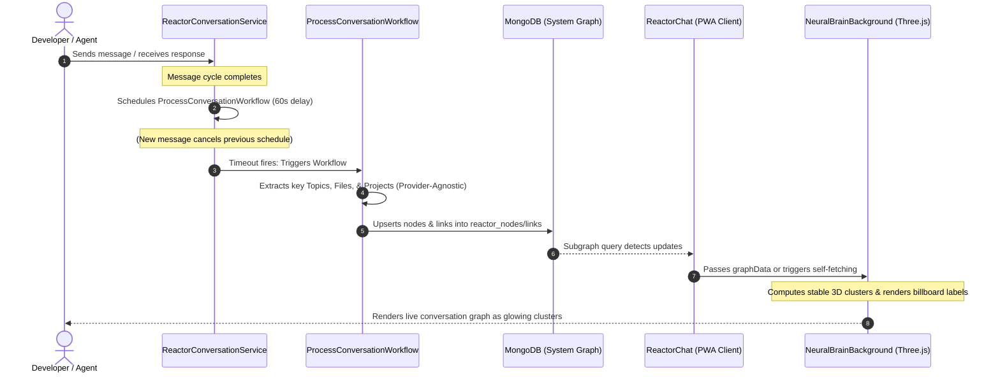

# Reactory Neural Background: Architecture, Integration & Data Flow Guide

This document provides a comprehensive technical overview of the **WebGL Neural Background Subsystem** (`NeuralBrainBackground.tsx`). It outlines the component's intent, visual capabilities, backend durable workflow integration, and the dynamic data loop that transforms live developer conversations into a glowing visual synapse map.

---

## 1. System Architecture Overview

The integration represents a synchronized loop between the client-side WebGL layer, the GraphQL API gateway, and the server-side durable workflow engine.

---

## 2. Component Intent & Capabilities

The neural graph surface is split into two components that share one data model:

1.  **`NeuralBrainBackground.tsx`** — the **ambient base layer** behind the chat. Pointer events off, auto-orbiting camera, no GraphQL. It renders the conversation graph the host passes in (`graphData`) plus the agent's touched nodes extracted from the chat history (`messages`). Decoration only.
2.  **`NeuralGraphViewer.tsx`** — the **interactive viewer** registered as `reactor.NeuralBackground@1.0.0` (side panel, `loadGraphPerspective` tool). It is a thin adapter over the shared **GraphExplorer** engine (`src/components/shared/GraphExplorer`, see its README) running in **3D mode**, so the chat viewer and the 2D `/reactor/graph` explorer have identical capabilities: lazy expansion, dependency/dependent traversal, path finding, search-jump, edge create/edit/delete, node data editing, hide/unhide, type filters, layouts, and the full perspective lifecycle (save / save-as / rename / duplicate / share / default / delete) with node positions, camera, filters and view mode persisted server-side.

### Dual Graph Perspective
Both components overlay two data perspectives:
*   **Conversation graph** (`origin: 'conversation'` / GraphExplorer root): the synthesized subgraph around the conversation node, produced server-side by `ProcessConversationWorkflow`. The viewer resolves it through `ReactorConversationNode` → `ReactorSubgraph` (depth 2) using the shared data layer; the background receives it from `ReactorChat` as `graphData`.
*   **Agent perspective** (`origin: 'agent'` / GraphExplorer `overlay`): the nodes and edges the agent has touched through the reactor graph tools (`searchGraph`, `exploreGraph`, `getGraphNode`, `graphChildren`, `graphLinks`, `createNodeEdge`) during the active session, extracted client-side from `tool_results` by the exported `extractAgentGraphFromMessages()` helper — no extra server round-trips. Re-derivation is keyed on `toolResultSignature()` so streamed tokens never trigger a re-parse. Agent nodes render brighter (background) / in the agent accent colour with an "agent" chip in the inspector (viewer).

### Viewer props (`reactor.NeuralBackground@1.0.0`)
`ReactorChat` keeps the side-panel item fed with `reactory, mode, primaryColor, secondaryColor, backgroundColor, graphData, messages, sessionId, onPinPerspective`; the `loadGraphPerspective` macro sets `perspective` (`'conversation' | 'agent' | <project or saved perspective name> | { rootId, depth, label }`). `NeuralGraphViewer` maps these onto GraphExplorer props (`conversationId`, `overlay`, `perspective`, `onPinPerspective`) — see `GraphExplorer/types.ts` for the contract.

### Key Visual & Technical Features (ambient background):
*   **Stable 3D Clustering**: Groups graph nodes by type (`TOPIC`, `FILE`, `FOLDER`, `PROJECT`, `SYSTEM`) and clusters them around dedicated 3D coordinate centers. It uses a **seed-based pseudo-random function** (`seedRandom`) to ensure that the same file or topic always renders in the exact same spot across page refreshes, providing visual continuity.
*   **Billboard Canvas Labels**: Spawns 2D HTML canvas-textured sprites floating above major hub neurons and project nodes. These labels automatically billboard (rotate to face the camera) and feature custom outline shadows to ensure maximum legibility against busy dark or light backgrounds.
*   **Interactive Synapses**: Renders glowing axons (`LineSegments`) linking related nodes. It pools animated electrochemical signal spheres (`SphereGeometry`) that travel along active axons.
*   **Haptic & Keyboard Interaction**: Moving the mouse raycasts interactive spark pulses outwards from hovered neurons, while typing on the keyboard triggers signal surges from project hubs.
*   **Strict Memory Management**: Disposes of all Three.js geometries, points materials, canvas textures, and renderers upon unmounting to guarantee zero GPU or memory leaks.

---

## 3. The Dynamic Graphing Loop

The visual background is populated dynamically as you converse with the AI or explore codebases:

### Phase A: Debounced Triggering
1.  When a message turn completes, `ReactorConversationService.ts` schedules the `ProcessConversationWorkflow` to run in **60 seconds** via a local `setTimeout`.
2.  If the developer sends another message before the 60 seconds expire, the pending timer is immediately cleared via `clearTimeout`. This ensures that graphing only runs when the developer pauses to think, read, or compile, preventing redundant background processing.

### Phase B: Provider-Agnostic Graph Extraction
1.  When the timer fires, the workflow engine executes the `ProcessConversationStep`.
2.  This step has been refactored to **extend `AgentConversationStep`**, making it completely provider-agnostic. Instead of hardcoding OpenAI API calls, it delegates the LLM turn to the parent class, which automatically resolves the persona's model, provider (OpenAI, Claude, Gemini, etc.), and credentials.
3.  The step passes a strict **JSON Schema** to the LLM to extract the conversation graph under `providerConfig.structuredOutput`. The model returns a structured JSON payload containing:
    *   `nodes`: Key projects, files, folders, or topics discussed.
    *   `edges`: The semantic relationships between them (e.g., `contains`, `references`, `depends_on`).

### Phase C: Graph Database Registration
1.  The workflow step creates a root node representing the **Conversation** itself.
2.  It generates deterministic, hashed IDs (`nodeId` and `linkId`) for all extracted items. Hashing ensures that re-graphing the same conversation updates existing nodes instead of creating duplicates.
3.  It upserts the nodes and links into MongoDB (`reactor_nodes` and `reactor_node_links` collections) and auto-links every extracted entity to the conversation root node via a `CONTAINS` edge.

### Phase D: Frontend Rendering
1.  The frontend detects the active session ID.
2.  `ReactorChat` queries the graph database via GraphQL (`ReactorSubgraph` query) up to a depth of **2** (with a limit of 120 nodes) and **polls every 15s** while the session is active — necessary because the workflow re-graphs the conversation ~60s after each completed turn. A graph **signature comparison** keeps the state identity stable when nothing changed, so the WebGL scene is only rebuilt on real graph updates (the standalone self-fetch applies the same dedup to its 10s loop).
3.  The retrieved nodes and edges are mapped to the Three.js canvas, instantly popping up as glowing neuron clusters with floating labels.
4.  The side-panel viewer (mounted via the 🧠 button) receives the same data as live props: ReactorChat pushes updated `graphData`, `messages`, and theme props into the mounted item via `sidePanelActions.updateItem()` whenever they change.

---

## 4. Dependent Elements & Files Touched

The WebGL background subsystem spans across multiple areas of the monorepo:

### PWA Client (`reactory-pwa-client`)
1.  **`src/components/shared/ReactorChat/components/NeuralBrainBackground.tsx`**:
    *   The core Three.js canvas rendering logic.
    *   Updated to support `showLabels` and the `reactory` SDK instance.
    *   Implemented the self-fetching React hook to pull graph data automatically when mounted standalone.
2.  **`src/components/shared/ReactorChat/components/SidePanel.tsx`**:
    *   Renders mounted workspace components.
    *   Updated the active tab wrapper `Box` to include `position: 'relative'` and `overflow: 'hidden'`. This establishes a local coordinate space, preventing the absolutely-positioned WebGL canvas from bleeding across other panels.
3.  **`src/components/shared/ReactorChat/hooks/macros/component.macro.tsx`**:
    *   The macro that handles mounting React components in the side panel.
    *   Removed the strict `typeof component === 'function'` check, which was causing memoized components (wrapped in `React.memo` or `React.forwardRef`) to be rejected as "invalid components".
4.  **`src/components/index.tsx`**:
    *   The central component registry.
    *   Registers `reactor.NeuralBackground@1.0.0` → `NeuralGraphViewerComponentDefinition` (`NeuralGraphViewer.tsx`, GraphExplorer in 3D). `NeuralBrainBackground` is imported directly by `ReactorChat` for the ambient layer.

### Express Server (`reactory-express-server`)
1.  **`src/modules/reactory-reactor/workflow/steps/ProcessConversationStep.ts`**:
    *   Refactored the step to inherit from `AgentConversationStep`.
    *   Replaced the hardcoded `OpenAIService` completion call with a provider-agnostic, structured-output configuration, allowing the step to use any configured LLM (e.g., Claude, Gemini) to extract the graph.
2.  **`src/modules/reactory-reactor/workflow/index.ts`**:
    *   Added `'ProcessConversationWorkflow'` to the module's registered workflows array so it is discovered and registered in the database on server startup.
3.  **`src/modules/reactory-reactor/workflow/ProcessConversationWorkflow.yaml`**:
    *   The durable workflow registry definition that orchestrates the graphing step.
