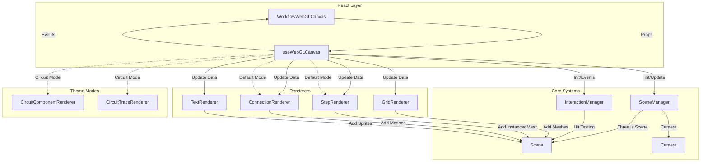
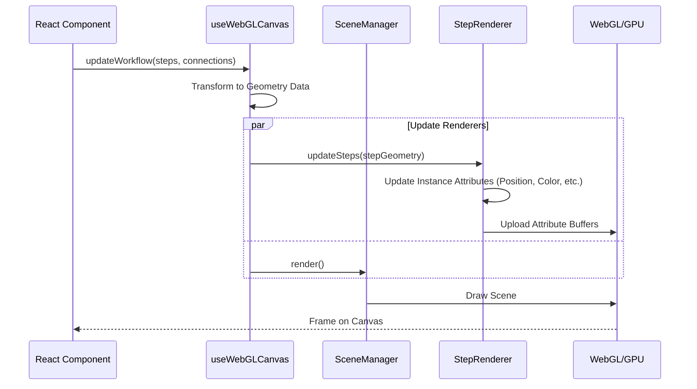
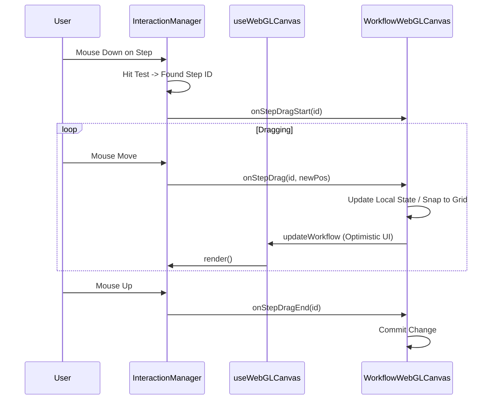

# WorkflowWebGLCanvas Documentation

This document describes the architecture and implementation of the `WorkflowWebGLCanvas` component and its associated `WebGLRenderer` system. This system provides a high-performance, GPU-accelerated rendering engine for the Workflow Designer, capable of handling large workflows with thousands of steps and connections.

## Overview

The `WorkflowWebGLCanvas` is a React component that wraps a Three.js-based WebGL renderer. It mimics the interface of the DOM-based `WorkflowCanvas` but delegates rendering to the GPU. It uses a hybrid approach where the main scene (steps, connections, grid) is rendered in WebGL, while some UI elements (selection rectangles, context menus, and sometimes labels) can be overlaid using HTML/CSS.

## Architecture

The system is built around a central hook `useWebGLCanvas` which orchestrates several specialized managers and renderers.

## Core Components

### 1. WorkflowWebGLCanvas (`WorkflowWebGLCanvas.tsx`)
The React entry point. It:
- Initializes the WebGL context via `useWebGLCanvas`.
- Handles high-level React events (drag-and-drop from library).
- Manages React state for UI overlays (metrics, selection box).
- Forwards props (definition, viewport, selection) to the renderer.

### 2. useWebGLCanvas (`useWebGLCanvas.ts`)
The central coordinator hook. It:
- Instantiates and manages the lifecycle of all renderers.
- Handles "Theme Mode" switching (Default vs. Circuit).
- Converts high-level Workflow data (Steps, Connections) into low-level Geometry data (`StepGeometryData`, `ConnectionGeometryData`).
- Runs the render loop (`requestAnimationFrame`).

### 3. SceneManager (`SceneManager.ts`)
Manages the raw Three.js environment.
- **Camera**: Uses an `OrthographicCamera` to simulate a 2D surface.
- **Renderer**: Configures the `THREE.WebGLRenderer`.
- **Coordinate Conversion**: Handles `screenToWorld` and `worldToScreen` transformations.
- **Performance**: Tracks FPS and draw calls.

### 4. InteractionManager (`InteractionManager.ts`)
Handles all user input on the canvas.
- **Events**: Listens for `mousedown`, `mousemove`, `wheel`, `touch`, etc.
- **Hit Testing**: Performs raycasting to detect clicks on Steps, Ports, and Connections.
- **State Machine**: Manages drag states (Panning, Dragging Step, Dragging Connection, Selection Box).
- **Dispatch**: Fires high-level events (`onStepClick`, `onConnectionSelect`) back to the React layer.

## Rendering Pipeline

The rendering process is optimized for performance using techniques like Instanced Rendering.

### Specialized Renderers

#### StepRenderer (`StepRenderer.ts`)
Uses `THREE.InstancedMesh` to render thousands of steps with a single draw call.
- **Shaders**: Custom Vertex and Fragment shaders (`STEP_VERTEX_SHADER`, `STEP_FRAGMENT_SHADER`) draw rounded rectangles with borders and shadows procedurally.
- **Attributes**: Per-instance data (position, size, color, selection state) is passed via `InstancedBufferAttribute`.

#### ConnectionRenderer (`ConnectionRenderer.ts`)
Renders connections as Bezier curves.
- **Geometry**: Generates a "ribbon" mesh (triangle strip) for each connection to allow for variable line thickness (WebGL lines are often limited to 1px).
- **Updates**: Re-generates geometry only when curve points change.

#### TextRenderer (`TextRenderer.ts`)
Renders text labels.
- **Technique**: Uses an HTML5 Canvas to draw text, creates a `THREE.CanvasTexture`, and displays it on a `THREE.Sprite`.
- **Optimization**: Updates texture resolution based on zoom level to maintain crisp text.

## Data Flow

1. **Prop Change**: `WorkflowWebGLCanvas` receives new `definition` or `selection`.
2. **Update Trigger**: `useEffect` calls `updateWorkflow` in `useWebGLCanvas`.
3. **Data Transformation**: The hook converts `WorkflowStepDefinition` objects into flat, render-ready `StepGeometryData` structures (resolving colors, sizes, and port positions).
4. **Renderer Update**: The geometry data is passed to `StepRenderer`, `ConnectionRenderer`, etc.
5. **Buffer Update**: Renderers update their Three.js geometry attributes.
6. **Render**: The next animation frame draws the updated scene.

## Interaction Flow (Example: Dragging a Step)

